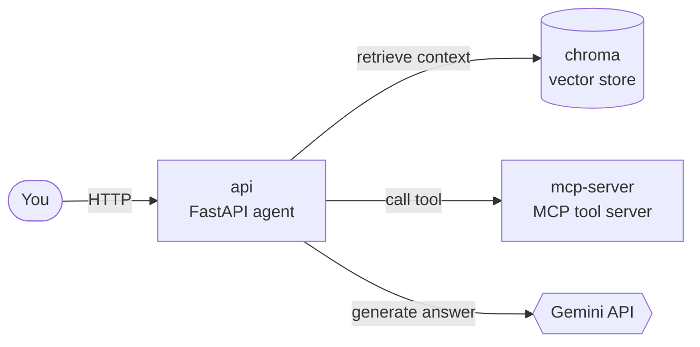
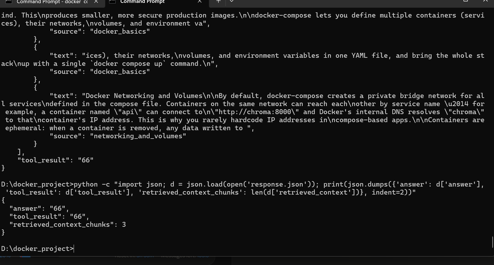

# Dockerized RAG + MCP Agent

[](https://github.com/asfm2003/docker-rag-mcp-agent/actions/workflows/docker-build.yml)

A small multi-container AI agent: a FastAPI service retrieves context from a
vector database, optionally calls a tool on a custom MCP (Model Context
Protocol) server, and asks Gemini to answer — all grounded in retrieved
documents rather than the model's own memory. Three independently built
services, wired together over a Docker network, each with its own Dockerfile,
healthcheck, and failure mode.



## Why this isn't just "a script in a container"

- **Three services, three separate concerns.** `chroma` is an off-the-shelf
  vector database (official image, no custom code). `mcp-server` is a
  hand-built MCP tool server exposed over SSE, reachable only from inside the
  Docker network — it has no port published to the host. `api` is the agent
  logic that ties retrieval, tool-calling, and generation together.
- **Multi-stage Docker builds.** `api/Dockerfile` separates a "builder" stage
  (compilers, build headers) from the runtime image, so none of the build
  tooling ships in the final image.
- **Real inter-service networking**, not `localhost` shortcuts — services
  address each other by Docker Compose service name (`chroma`, `mcp-server`),
  resolved through Docker's internal DNS.
- **CI that actually builds it.** The GitHub Actions workflow builds both
  custom images on every push — the badge above is proof the Dockerfiles work
  in a clean environment, not just on one machine.
- **Debugged, not just demoed.** See [`docs/LEARNING.md`](docs/LEARNING.md#real-bugs-hit-while-building-this-and-how-they-were-diagnosed)
  for the real bugs hit while building this — a build-context mistake, a
  version-mismatch crash between a pinned server image and an unpinned client
  library, and a prompt logic bug — and how each was actually diagnosed from
  container logs, not guessed at.

## Demo

A real request hitting all three containers — retrieval from Chroma, a tool
call to the MCP server, and generation via Gemini:



## Quickstart

```bash
git clone https://github.com/YOUR_USERNAME/docker-rag-mcp-agent.git
cd docker-rag-mcp-agent
cp .env.example .env   # add your GEMINI_API_KEY (https://aistudio.google.com/apikey)
docker compose up --build -d
curl -X POST http://localhost:8000/ingest/sample-docs
curl -X POST http://localhost:8000/chat \
  -H "Content-Type: application/json" \
  -d '{"query": "What does a Docker healthcheck do?"}'
```

## What's inside

```
docker-rag-mcp-agent/
├── docker-compose.yml       # orchestrates all three services
├── api/
│   ├── Dockerfile            # multi-stage build
│   └── app/
│       ├── main.py           # FastAPI endpoints: /health /ingest /chat /tools
│       ├── rag.py            # Chroma client wrapper
│       └── mcp_client.py     # MCP SSE client
├── mcp_server/
│   ├── Dockerfile
│   └── server.py             # MCP tool server: calculator, word_count
├── data/sample_docs/         # sample text for the /ingest/sample-docs endpoint
└── .github/workflows/        # CI: builds both images on every push
```

## What I'd add before calling this production-ready

Being upfront about the gap between "runs locally" and "production system"
is itself part of demonstrating engineering judgment:

- **Retries / circuit-breaking** around the `chroma` and MCP calls in
  `main.py` — right now a dependency outage 500s the whole request instead of
  degrading gracefully (see the "break it on purpose" exercises in
  [`docs/LEARNING.md`](docs/LEARNING.md#part-3--break-it-on-purpose)).
- **Secrets management** beyond a local `.env` file — a real deployment would
  use a secrets manager (AWS Secrets Manager, Vault, Docker/Kubernetes
  secrets) rather than an environment variable sourced from a plaintext file.
- **Structured logging and tracing** across the three services, so a failed
  request can be followed end-to-end instead of grepped for across three
  `docker compose logs` streams.
- **Horizontal scaling** for `api` — it's currently a single container; a
  real deployment would run multiple replicas behind a load balancer, which
  changes how you think about state (none of it currently lives in `api`
  itself, which is a deliberate, scaling-friendly choice).

## Learning walkthrough

If you want the guided, step-by-step version of building and running this
(what each Docker concept means, what to expect at each command, exercises
that intentionally break things to show how Docker recovers) — see
[`docs/LEARNING.md`](docs/LEARNING.md).

## License

MIT — see [LICENSE](LICENSE).
